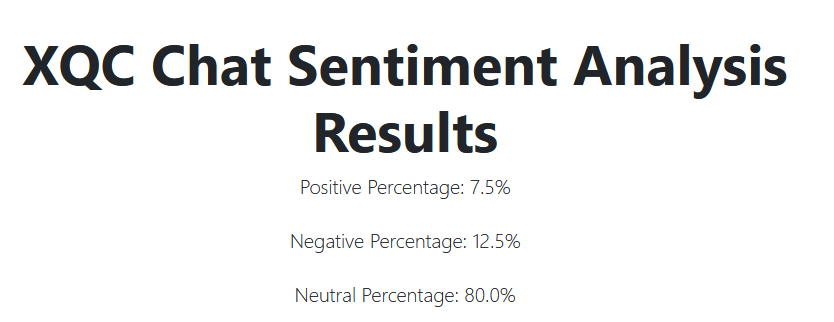

# Kick.com Chat Sentiment Analysis

This is a quick test on queriying the Kick.com APIs to get information on users and chat

## Installation

Chromedriver for Chromium - https://chromedriver.chromium.org/downloads

Python3 is required

Clone the repository 

pip install the requirements

```bash
pip install requirements
```

## Usage

Run the flask application

```bash
python ./Kick-Sentimentanalysis
```

Enter in the streamer you want and the results will take a few seconds to show.


I have also added an endpoints for the currently known endpoints for the kick apis.

Probably can't access most of them though 

## License

[MIT](https://choosealicense.com/licenses/mit/)

